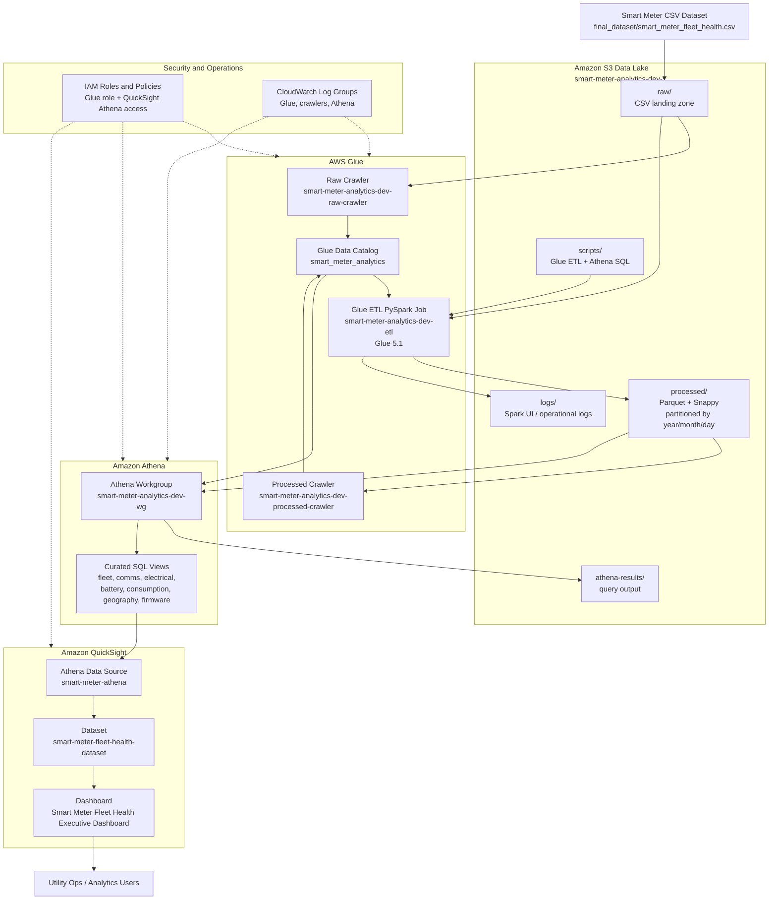

# Smart Meter Fleet Health Analytics Platform

Production-oriented serverless analytics platform for smart meter fleet health monitoring using AWS managed services.

## Architecture



### Data Flow

1. The CSV lands in the S3 raw zone.
2. The raw Glue crawler catalogs the CSV schema.
3. The Glue 5.1 PySpark ETL job reads raw CSV, normalizes data, removes duplicates, converts timestamps, recomputes health fields, and writes Snappy Parquet.
4. The processed crawler catalogs Parquet partitions by `year/month/day`.
5. Athena queries the processed table and curated views.
6. QuickSight connects to Athena through `smart-meter-athena`, uses dataset `smart-meter-fleet-health-dataset`, and publishes the executive dashboard.

## Repository Layout

```text
final_dataset/
  smart_meter_fleet_health.csv
  smart_meter_fleet_health.parquet
  validation_report.json

terraform/
  S3, Glue, IAM, Athena, CloudWatch infrastructure

glue/
  glue_smart_meter_etl.py

athena/
  sql/
    01_create_views.sql
  queries/
    fleet_summary.sql
    communication_health.sql
    electrical_health.sql
    battery_health.sql
    consumption.sql
    geography.sql
    firmware.sql

dashboards/
  quicksight_dashboard_design.md

docs/
  deployment_guide.md
  smart_meter_platform_explained.md

iam/
  glue-service-role-policy.json
```

## AWS Services Used

- Amazon S3 for raw, processed, Athena results, scripts, dashboard metadata, and logs prefixes.
- AWS Glue Crawlers for raw CSV and processed Parquet discovery.
- AWS Glue Data Catalog for Athena/QuickSight metadata.
- AWS Glue ETL Job for reusable PySpark transformation.
- Amazon Athena for SQL analytics and curated views.
- Amazon QuickSight for executive dashboards.
- IAM roles and policies for least-privilege service access.
- CloudWatch Log Groups for Glue and Athena operational logs.

## Data Lake Layout

Terraform creates one private S3 bucket with this prefix layout:

```text
smart-meter-analytics/
  raw/
  processed/
  athena-results/
  scripts/
  dashboards/
  logs/
```

Processed data is written as:

```text
smart-meter-analytics/processed/year=YYYY/month=MM/day=DD/*.parquet
```

## ETL Behavior

The Glue job:

- Reads CSV from the S3 raw zone.
- Infers schema and normalizes expected columns.
- Handles null string, numeric, and boolean values.
- Converts timestamps.
- Removes duplicate `meter_id + timestamp` records.
- Adds `event_date`, `year`, `month`, and `day`.
- Recomputes `issue_count` and `health_status`.
- Writes Snappy-compressed Parquet partitioned by `year/month/day`.
- Updates the Glue Data Catalog.
- Is rerunnable and can clear/rewrite the processed zone.

## Deployment

See [docs/deployment_guide.md](docs/deployment_guide.md).

For a beginner-to-advanced explanation of how the system works, read
[docs/smart_meter_platform_explained.md](docs/smart_meter_platform_explained.md).

Short version:

```bash
cd terraform
terraform init
terraform plan -out tfplan
terraform apply tfplan
```

Then run:

```bash
aws glue start-crawler --name "$(terraform output -raw raw_crawler_name)"
aws glue start-job-run --job-name "$(terraform output -raw glue_job_name)"
aws glue start-crawler --name "$(terraform output -raw processed_crawler_name)"
```

Run `athena/sql/01_create_views.sql` after processed data is cataloged.

## Athena Analytics

Curated views:

- `vw_fleet_summary`
- `vw_communication_health`
- `vw_electrical_health`
- `vw_battery_health`
- `vw_daily_consumption`
- `vw_monthly_consumption`
- `vw_geographic_health`
- `vw_firmware_distribution`
- `vw_top_consumers`

These support:

- Fleet Summary
- Communication Health
- Electrical Health
- Battery Health
- Consumption
- Geography
- Firmware

## QuickSight Dashboard

Dashboard spec is in [dashboards/quicksight_dashboard_design.md](dashboards/quicksight_dashboard_design.md).

Live dashboard:

- Name: `Smart Meter Fleet Health Executive Dashboard`
- ID: `smart-meter-fleet-health-executive-dashboard`
- Published version: `2`
- Sheets: `Executive Overview`, `Operations Detail`

Glue Studio visual companion job:

- Name: `smart-meter-analytics-dev-visual-etl`
- Mode: `VISUAL`
- Runtime: Glue `5.1`
- Nodes: raw CSV source -> schema mapping -> Parquet preview target

Top KPI cards:

- Total Smart Meters
- Healthy
- Warning
- Critical
- Average Voltage
- Average RSSI
- Average Battery %
- Average Consumption

Filters:

- State
- District
- DISCOM
- Firmware Version
- Health Status
- Date Range

## Estimated Monthly Cost

For this 50,000-row sample dataset in `us-east-1`, expected monthly cost is low:

| Service | Estimate |
| --- | ---: |
| S3 storage | Under $1 |
| Glue crawler runs | Under $1 for occasional runs |
| Glue ETL | Usually $1-$5 depending on run frequency |
| Athena | Cents to low dollars if queries scan Parquet partitions |
| CloudWatch logs | Under $1 for normal development use |
| QuickSight | Depends on account edition and author/reader pricing |

Cost controls:

- Process to Parquet with Snappy.
- Partition by date.
- Use Athena workgroup output controls.
- Expire Athena result files after 30 days.
- Expire log prefixes after 90 days.
- Use SPICE refresh schedules rather than excessive direct queries.

## Security Best Practices

- S3 bucket blocks all public access.
- S3 bucket uses server-side encryption.
- IAM role is scoped to the data lake bucket and Glue Catalog operations.
- No credentials are stored in code.
- CloudWatch logs use retention policies.
- QuickSight row-level security can be added later by state, district, or DISCOM.

## Troubleshooting

### Glue crawler does not create a table

- Confirm the CSV exists under `smart-meter-analytics/raw/`.
- Check crawler logs in CloudWatch.
- Re-run the raw crawler after upload completes.

### Glue job fails with access denied

- Confirm the Glue role has the Terraform-managed inline policy.
- Confirm the S3 bucket name in policy matches the Terraform output.

### Athena cannot find processed table

- Run the Glue ETL job first.
- Run the processed crawler.
- Confirm table `smart_meter_fleet_health` exists in Glue database `smart_meter_analytics`.

### Athena queries scan too much data

- Use `event_date`, `year`, `month`, and `day` filters.
- Query curated views where possible.
- Keep processed data in Parquet, not CSV.

### QuickSight cannot see Athena data

- Make sure QuickSight has access to Athena and the S3 data lake bucket.
- In QuickSight security settings, allow the S3 bucket used for Athena results and processed data.

## Future Real AMI/HES Integration

The architecture does not depend on the sample dataset. Future AMI/HES exports can land in the same raw S3 prefix with the same logical columns, then reuse the crawler, Glue ETL job, partitioned Parquet layout, Athena views, and QuickSight dashboard.
